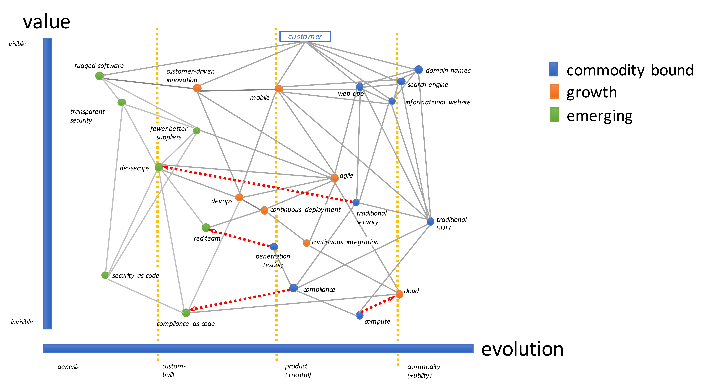

# Wardley Maps for Security

Wardley Maps are very useful for mapping out strategies along with terrain to advance security controls and efforts.  For those not familiar with this concept, it was developed by Simon Wardley (@swardley) and has derived into a very useful tool for prioritizing the right work at the right time to increase the odds of successfully completing a mission.  If you are interested in learning more about this tool and how to build a Wardley Map there is great information here: [Wardley Blog](http://blog.gardeviance.org/2015/02/an-introduction-to-wardley-value-chain.html)

The DevSecOps tribe is using this format to begin an effort that helps security teams to uplevel their security programs and share forward momentum without getting lost in minutia. In order to get the ball rolling, we have developed the following map to show the changing landscape for security with the emergence of DevOps, Mobile, and greater demands for security in software.  We're completely open to feedback on this map and will continue to develop greater depth via add-on maps to further illustrate community efforts towards transforming security to meet the demands of DevOps. 

*Figure 1*

